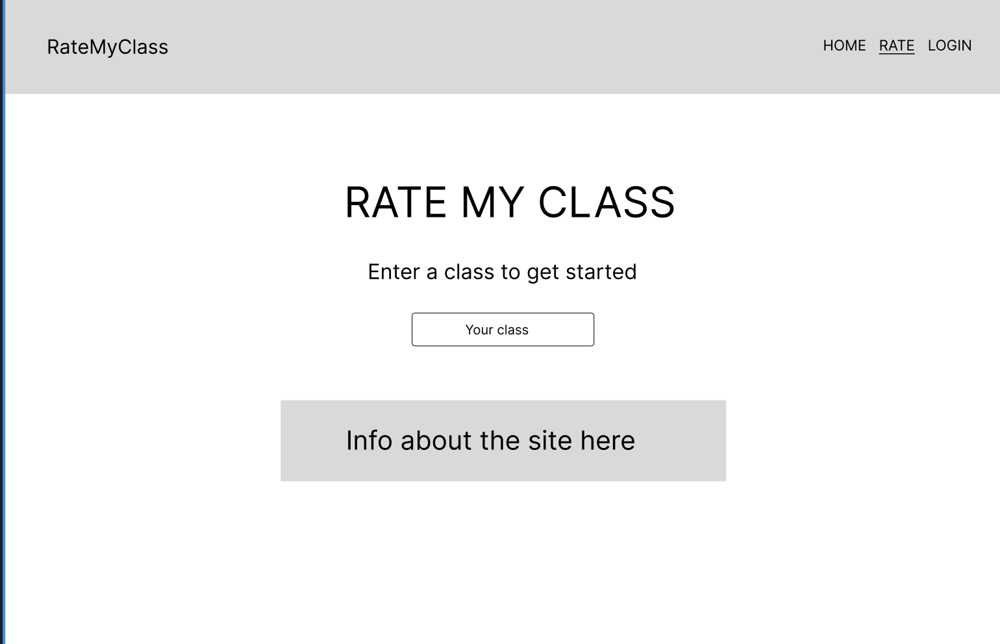
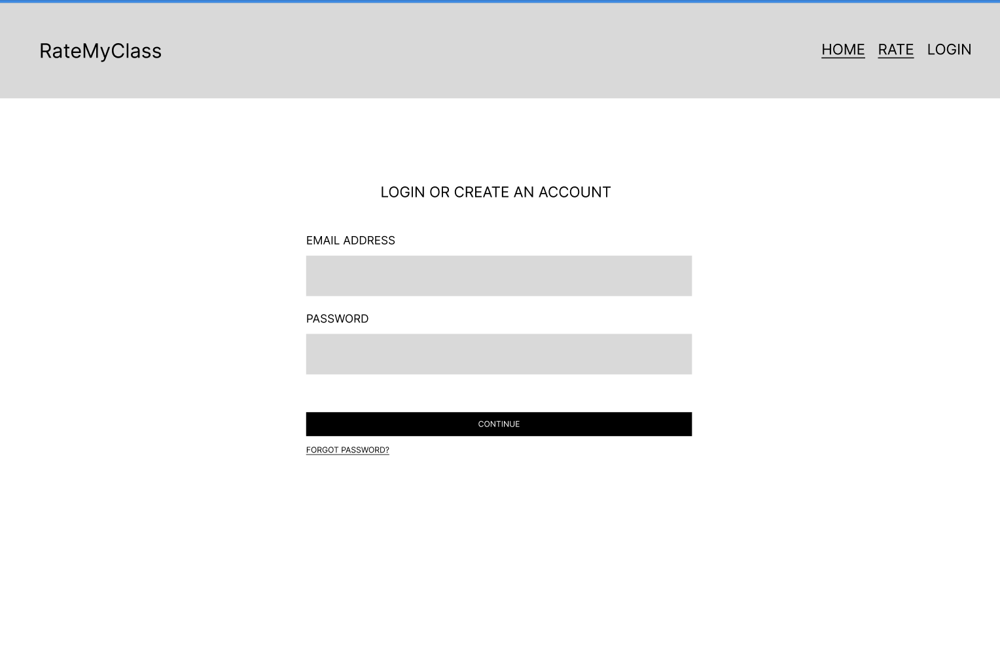
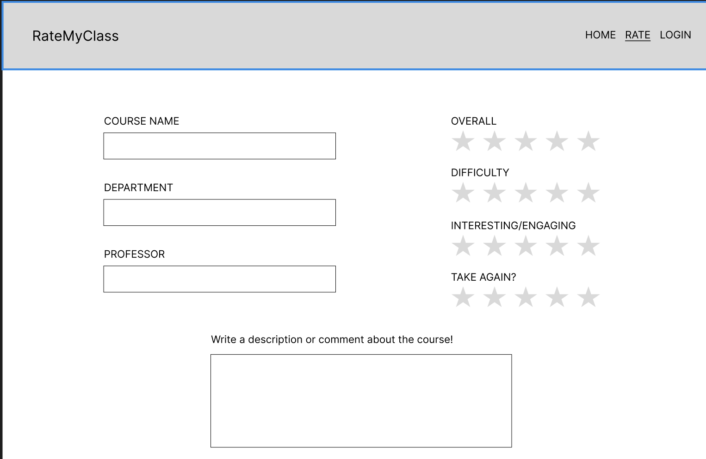
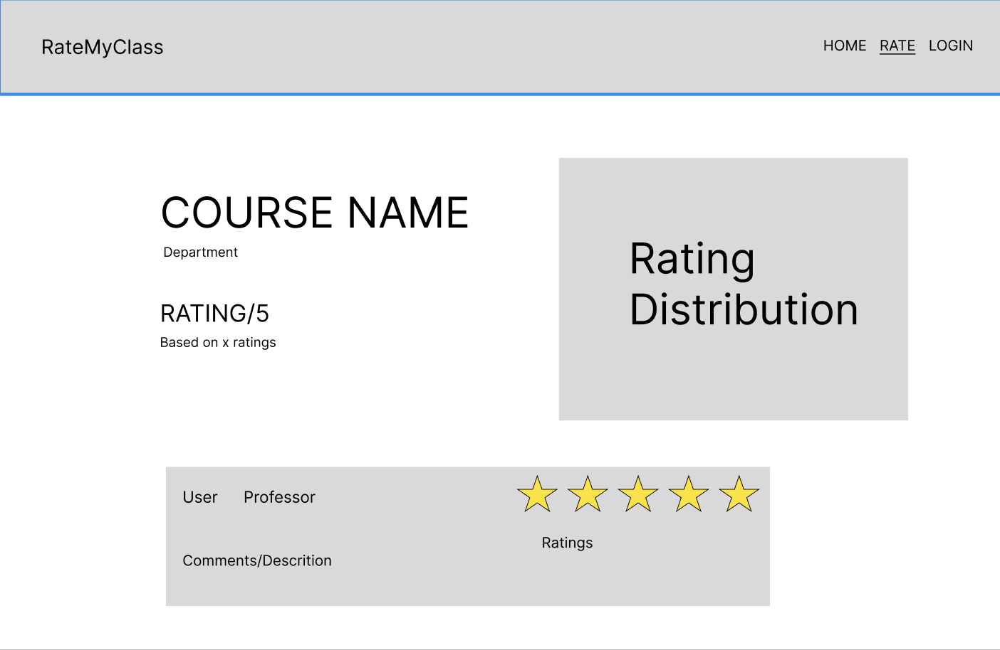

# RateMyClass

## Overview


College students have heard RateMyProfessor, the site where students go to check out a professor rating. Some may have even heard of RateMyDorm which provides information on university dorms across the nation. Introducing RateMyClass, a site where  students can creates an account to upload their ratings of individuals classes at NYU.

Students users can create their account to have authorization to upload ratings, but can view ratings without creating an account.
Within the rating section students select a rating for Overall, Difficulty, Engagement, and Take Again? while specifying the course, department, and their professor. They are also required to give comment/description of the class. On the page to view each course, visitors can see an overall rating, for the class and the comments and specialized ratings left by each user


## Data Model

The application will store Users and Courses

* users can have multiple courses (via references)
* each course can have multiple items (by embedding)

An Example User:

```javascript
{
  _id: "ObjectID()",
  username: "collegestudent",
  password: "collegestudent1",
  review: // an array of references to review documents
}
```

An Example Review with Embedded Ratings:

```javascript
{
  _id: "review1",
  user_id: "user123",
  course_name: "Introduction to Computer Science",
  course_code: "CS467",
  department: "Applied Internet Technology",
  professor: "Professor Versoza",
  comment: "Great course, but the assignments were tough!",
  ratings: {
    overall: 4.5,
    difficulty: 3,
    engagement: 4,
    take_again: 5
  },
  created_at: "2025-03-18T12:00:00Z"
}
```


## [Link to Commented First Draft Schema](backend/models/user.js) 


## Wireframes


/ - main page



/login - login page



/upload - upload review page



/course/slug - course page



## Site map

[site map](documentation/sitemap.png)

## User Stories or Use Cases

1. as non-registered user, I can register a new account with the site
2. as non-registered user, I can search and browse ratings
3. as a user, I can log in to the site
4. as a user, I can create a new rating
5. as a user, I can view all of the ratings I've created in the past
6. as a user, I can add delete my ratings


## Research Topics

(__TODO__: the research topics that you're planning on working on along with their point values... and the total points of research topics listed)

* (3 points) jsonwebtoken
    * I want to use JWT to allow users to access certain parts of my site only when they logged in and this module seems to work well with a react.js front-end.
* (3 points) axios
    * I need axios since it simplifies API requests between frontend and backend as well as automatically attaching authentication tokens(JWT) for protected actions
* (3 points) react.js
    * used react.js as the frontend framework; it's a challenging library, so I've assigned it 3
* (2 point) tailwind
    * I will be using tailwind for css
* (1 point) react-simple-star-rating
    * I want to make a rating using stars for users to rate classes from 1 to 5

10 points total out of 8 required points (___TODO__: addtional points will __not__ count for extra credit)


## [Link to Initial React Frontend App](frontend/src/App.jsx) 
## [Link to backend app](backend/app.mjs)


## Annotations / References Used

1. [star package](https://www.npmjs.com/package/react-simple-star-rating) - (https://github.com/nyu-csci-ua-0467-001-002-spring-2025/final-project-deployment-plant445/blob/master/frontend/src/pages/CreateReview.jsx#L109-L193)

2. [jwt + cookie link 1](https://www.npmjs.com/package/jsonwebtoken)
   [jwt + cookie link 2](https://strapi.io/blog/introduction-to-jwt-and-cookie-storage)

   (https://github.com/nyu-csci-ua-0467-001-002-spring-2025/final-project-deployment-plant445/blob/master/backend/controllers/userController.js)

3. [authentication tip](https://cheatsheetseries.owasp.org/cheatsheets/Authentication_Cheat_Sheet.html )

